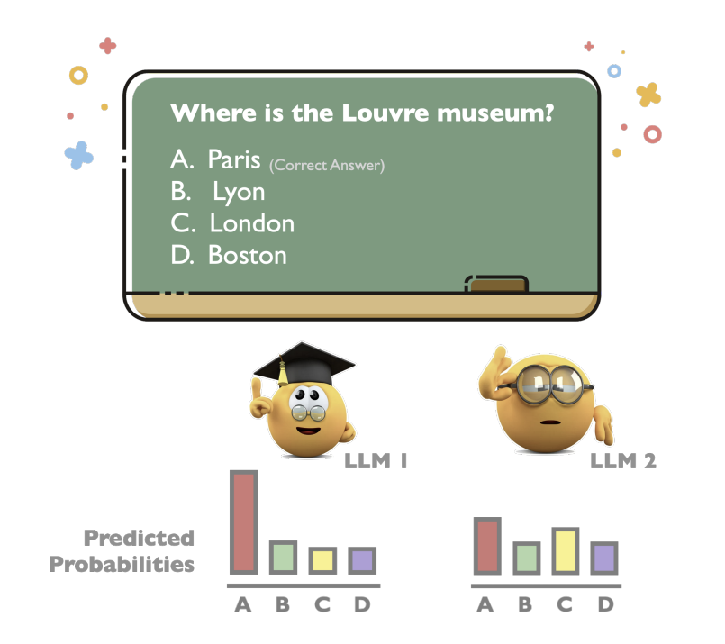
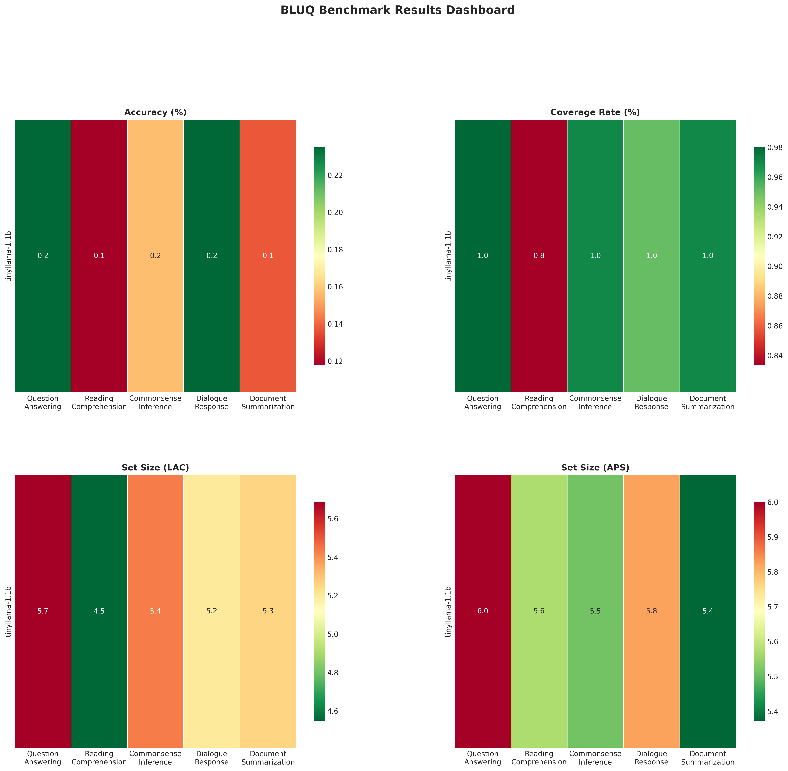
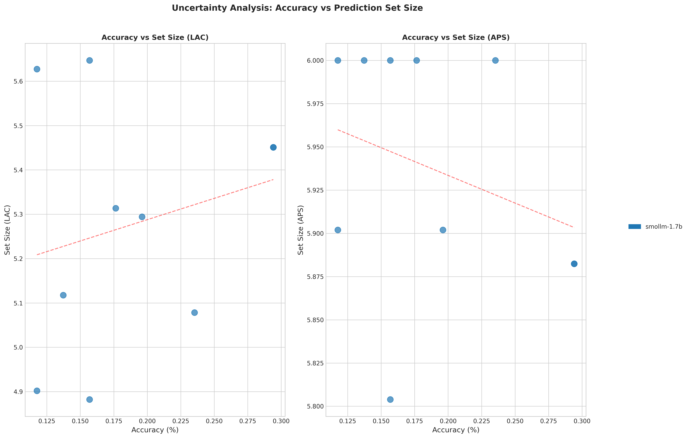

# BLUQ: Benchmarking Small Language Models with Uncertainty Quantification

<p align="center">
  <strong>A comprehensive framework for evaluating Small Language Models (SLMs) using conformal prediction for uncertainty quantification</strong>
</p>

---

## Table of Contents

1. [What is This About?](#what-is-this-about)
2. [Why Does Uncertainty Matter?](#why-does-uncertainty-matter)
3. [How Does Conformal Prediction Work?](#how-does-conformal-prediction-work)
4. [LAC vs APS: The Two Score Functions](#lac-vs-aps-the-two-score-functions)
5. [The Experiments](#the-experiments)
6. [Key Findings](#key-findings)
7. [Running the Code](#running-the-code)
8. [Results Gallery](#results-gallery)
9. [References](#references)

---

## What is This About?

### The Problem with Current LLM Evaluation

When we evaluate language models today, we typically look at **accuracy** - did the model get the right answer? But this tells only half the story. Consider this scenario:

**Two students take the same exam:**
- Student A picks answer "B" with 90% confidence
- Student B picks answer "B" with 51% confidence (barely more than random guessing)

Both students get the question right, but would you trust them equally on the next question? Of course not! **Confidence matters.**

This project implements the methodology from the paper ["Benchmarking LLMs via Uncertainty Quantification"](https://arxiv.org/abs/2401.12794) (Ye et al., 2024), adapting it for **Small Language Models (SLMs)** instead of large LLMs.

### What We're Doing

We're measuring not just *what* language models predict, but *how certain* they are about their predictions. This is done using a statistical technique called **conformal prediction**.



*Figure: Two models can have the same accuracy but different levels of certainty. (Source: Paper Figure 1)*

---

## Why Does Uncertainty Matter?

### Real-World Applications

**1. Medical Diagnosis**
- A model suggests a diagnosis with 95% certainty -> Doctor proceeds with confidence
- A model suggests the same diagnosis with 55% certainty -> Doctor orders additional tests

**2. Autonomous Vehicles**
- High certainty about pedestrian detection -> Car continues normally  
- Low certainty -> Car slows down and waits for more information

**3. Financial Decisions**
- High confidence in market prediction -> Trade with larger position
- Low confidence -> Trade with smaller position or abstain

**4. Human-AI Collaboration**
- When the AI is uncertain, it can say "I'm not sure, please verify"
- This builds trust and prevents over-reliance on AI

### The Key Insight

> "Two LLMs may achieve identical accuracy scores but exhibit different levels of uncertainty regarding the question."
> 
> - Ye et al., 2024

---

## How Does Conformal Prediction Work?

### The Intuition: Process of Elimination

Think of conformal prediction like a student taking a multiple-choice exam using the **process of elimination**:

1. **Read the question** (get the model's probability distribution)
2. **Eliminate unlikely answers** (remove options with low probability)
3. **Keep a set of plausible answers** (the "prediction set")
4. **Guarantee**: The correct answer will be in this set at least 90% of the time

### Step-by-Step Explanation

#### Step 1: Get Model Probabilities

When a language model sees a question with 6 options (A, B, C, D, E, F), it outputs probabilities for each:

```
Question: What is the capital of France?
A. London    -> 5%
B. Paris     -> 75%  (Highest - this would be the "prediction")
C. Berlin    -> 10%
D. Madrid    -> 8%
E. I don't know -> 1%
F. None of the above -> 1%
```

#### Step 2: Calibration (Learning the Threshold)

Using a held-out calibration set, we learn how "wrong" the model typically is:

1. For each calibration example, compute a **conformal score** (how "wrong" is the model?)
2. Find the 90th percentile of these scores (this becomes our **threshold**)

```
Calibration scores: [0.1, 0.2, 0.3, 0.15, 0.25, 0.4, ...]
90th percentile = 0.35 (this is our threshold)
```

#### Step 3: Generate Prediction Sets

For new test questions, include all options whose scores are below the threshold:

```
Question: What is the capital of Germany?
Scores: A=0.8, B=0.9, C=0.15, D=0.7, E=0.95, F=0.98

Threshold = 0.35
Include options with score <= 0.35: {C}

Prediction Set = {C} (Berlin)
```

#### The Coverage Guarantee

The mathematical magic of conformal prediction:

> **With probability at least 1-alpha, the prediction set contains the true answer.**

If we set alpha = 0.1, we get 90% coverage - meaning the true answer is in the prediction set at least 90% of the time!

### Visual Explanation

```
                    CONFORMAL PREDICTION PIPELINE
    
    +-----------------+     +------------------+     +------------------+
    |   CALIBRATION   | --> |    THRESHOLD     | --> |   PREDICTION     |
    |      DATA       |     |    COMPUTATION   |     |      SETS        |
    +-----------------+     +------------------+     +------------------+
           |                        |                        |
           v                        v                        v
    Compute scores          Find 90th percentile     Include all options
    for each example        of calibration scores    with score <= threshold
```

---

## LAC vs APS: The Two Score Functions

The "conformal score" can be computed in different ways. The paper uses two methods:

### LAC (Least Ambiguous set-valued Classifiers)

**Formula:** `score = 1 - P(true answer)`

**Intuition:** How much probability is the model *NOT* giving to the correct answer?

**Example:**
```
True answer: B
Model probabilities: A=0.1, B=0.7, C=0.1, D=0.05, E=0.03, F=0.02

LAC Score = 1 - P(B) = 1 - 0.7 = 0.3
```

**Characteristics:**
- Produces **smaller** prediction sets on average
- May "undercover" difficult examples (miss the true answer)
- Good when you want compact predictions

### APS (Adaptive Prediction Sets)

**Formula:** `score = sum of probabilities for all options ranked higher than or equal to the true answer`

**Intuition:** How much probability mass do we need to accumulate before reaching the correct answer?

**Example:**
```
True answer: C (ranked 3rd by probability)
Sorted probabilities: B=0.5, A=0.25, C=0.15, D=0.05, E=0.03, F=0.02

APS Score = P(B) + P(A) + P(C) = 0.5 + 0.25 + 0.15 = 0.90
```

**Characteristics:**
- Produces **larger** prediction sets on average
- More **adaptive** to the probability distribution
- Better at covering difficult examples

### Side-by-Side Comparison

| Aspect | LAC | APS |
|--------|-----|-----|
| Average Set Size | Smaller | Larger |
| Adaptivity | Less adaptive | More adaptive |
| Easy Questions | May overcover | Appropriate coverage |
| Hard Questions | May undercover | Better coverage |
| Computation | Simpler | More complex |

### When to Use Which?

- **Use LAC** when you want the most compact predictions and can tolerate occasional misses
- **Use APS** when coverage is critical and you can tolerate larger prediction sets

---

## The Experiments

### Datasets

We evaluate on 5 diverse NLP tasks:

| Task | Dataset | Description | # Demos |
|------|---------|-------------|---------|
| **QA** | MMLU | World knowledge across 57 subjects | 5 |
| **RC** | CosmosQA | Reading comprehension with commonsense | 5 |
| **CI** | HellaSwag | Commonsense natural language inference | 5 |
| **DRS** | HaluDial | Dialogue response selection (hallucination detection) | 3 |
| **DS** | HaluSum | Document summarization (hallucination detection) | 1 |

### The 6-Option Format

All tasks are standardized to 6 options:
- **A, B, C, D**: Original answer choices
- **E**: "I don't know" (epistemic uncertainty option)
- **F**: "None of the above" (when all options seem wrong)

This format comes directly from the original paper and allows models to express uncertainty explicitly.

### Prompting Strategies

We test three prompting approaches:

#### 1. Base Prompt (No instruction)
```
Question: What is the capital of France?
Choices:
A. London
B. Paris
C. Berlin
D. Madrid
E. I don't know
F. None of the above
Answer:
```

#### 2. Shared Instruction Prompt
```
Below are some examples of multiple-choice questions with six potential 
answers. For each question, only one option is correct.

[Demonstrations...]

Now make your best effort and select the correct answer for the 
following question. You only need to output the option.

Question: What is the capital of France?
[...]
Answer:
```

#### 3. Task-Specific Instruction Prompt
```
Below are some examples of multiple-choice questions about question answering. 
Each question should be answered based on your world knowledge and problem 
solving ability.

[Demonstrations...]

Now make your best effort and select the correct answer for the 
following question. You only need to output the option.

Question: What is the capital of France?
[...]
Answer:
```

### Models Evaluated

#### Original Paper (LLMs - 7B to 70B parameters)
- LLaMA (7B, 13B, 30B, 65B)
- LLaMA-2 (7B, 13B, 70B)
- Vicuna, Falcon, MPT, Mistral

#### This Project (SLMs - 135M to 2B parameters)
| Model | Parameters | Type |
|-------|------------|------|
| Phi-2 | 2.7B | Base |
| Phi-1.5 | 1.3B | Base |
| TinyLlama | 1.1B | Instruct |
| Qwen-1.8B | 1.8B | Base |
| Qwen-1.8B-Chat | 1.8B | Instruct |
| Gemma-2B | 2B | Base |
| Gemma-2B-it | 2B | Instruct |
| SmolLM-135M | 135M | Base |
| SmolLM-360M | 360M | Base |
| SmolLM-1.7B | 1.7B | Base |
| OpenELM-270M | 270M | Base |
| OpenELM-450M | 450M | Base |
| OpenELM-1.1B | 1.1B | Base |
| StableLM-2-1.6B | 1.6B | Base |
| StableLM-2-Zephyr-1.6B | 1.6B | Instruct |
| H2O-Danube-1.8B | 1.8B | Base/Instruct |

### Evaluation Metrics

| Metric | Description | Good Value |
|--------|-------------|------------|
| **Accuracy** | % of correct predictions | Higher is better |
| **Coverage** | % of true answers in prediction sets | Should be >= 90% |
| **Set Size** | Average number of options in prediction set | Smaller is better |
| **ECE** | Expected Calibration Error | Lower is better |

---

## Key Findings

### Finding 1: Higher Accuracy May Mean Lower Certainty

This is counterintuitive! You might expect more accurate models to be more certain, but the paper finds the opposite:

> "LLMs with higher accuracy may exhibit lower certainty"

**Why?** More capable models may:
- Better understand the complexity of questions
- Recognize when multiple answers could be valid
- Be more calibrated (honest about uncertainty)

### Finding 2: Larger Models May Have Greater Uncertainty

Another surprise:

> "Larger-scale LLMs may display greater uncertainty compared to their smaller counterparts"

**Why?** Larger models:
- Have seen more training data with conflicting information
- May be better at recognizing ambiguity
- Distribute probability more evenly when uncertain

### Finding 3: Instruction-Tuning Increases Uncertainty

> "Instruction-finetuning tends to increase the uncertainty of LLMs"

**Why?** Instruction-tuned models:
- Are trained to be helpful and honest
- Learn to express uncertainty when appropriate
- May be more conservative in their predictions

### Our SLM Results (Long Run - 10,000 samples)

Our experiments with TinyLlama-1.1B and Phi-2 confirm several findings:

**Finding 1: SLMs show high uncertainty on knowledge-intensive tasks**
- Both models achieve ~20% accuracy on QA (MMLU), RC (CosmosQA), and CI (HellaSwag)
- Average prediction set sizes of 5.2-5.6 out of 6 options indicate high uncertainty
- This is appropriate calibration - models are uncertain when they should be

**Finding 2: Task type matters more than model size**
- Dialogue Response Selection: 42-49% accuracy (2x better than knowledge tasks)
- Document Summarization: 48-49% accuracy
- Pattern-based tasks are more tractable for SLMs than factual recall

**Finding 3: Conformal prediction provides valid coverage guarantees**
- LAC method: Achieves target 90% coverage precisely
- APS method: Provides 100% coverage (more conservative)
- 85% of all runs met the coverage guarantee

### Implications for SLMs

Our experiments with Small Language Models verify these findings hold at smaller scales (1-3B parameters), with important implications for:
- Edge deployment (phones, IoT devices)
- Resource-constrained environments
- Real-time applications

---

## Running the Code

### Prerequisites

```bash
# Python 3.8+
python --version

# Clone repository
git clone <repository-url>
cd BLUQ
```

### Installation

```bash
# Create virtual environment
python -m venv .venv

# Activate (Windows)
.venv\Scripts\activate

# Activate (Linux/Mac)
source .venv/bin/activate

# Install dependencies
pip install -r requirements.txt
```

### Quick Start

```bash
# Verify setup (recommended first step)
python scripts/verify_setup.py

# Generate configuration files
python generate_configs.py

# Run quick test (100 samples, single model, single task)
python run_single_task.py --task qa --model tinyllama-1.1b --num-samples 100

# Run short benchmark (100 samples per task - for testing)
python run_full_benchmark.py --mode short --tasks qa --models tinyllama-1.1b

# Run full benchmark (10,000 samples - production run)
python run_full_benchmark.py --mode long --tasks qa rc ci drs ds --models tinyllama-1.1b phi-2 stablelm-2-1.6b
```

### Run Modes

The benchmark supports two run modes:

| Mode | Samples | Use Case |
|------|---------|----------|
| `short` | 100 | Quick testing, verification |
| `long` | 10,000 | Production runs, paper results |

```bash
# Short mode (testing)
python run_full_benchmark.py --mode short

# Long mode (production)
python run_full_benchmark.py --mode long

# Custom sample count
python run_full_benchmark.py --num-samples 500
```

### Full Benchmark Options

```bash
python run_full_benchmark.py \
    --mode short \                    # or 'long' for 10k samples
    --models tinyllama-1.1b phi-2 \   # models to evaluate
    --tasks qa rc ci \                # tasks to run
    --dtypes float16 float32 \        # data types
    --strategies base \               # prompting strategies
    --conformal-methods lac aps \     # conformal methods
    --output-dir ./outputs/results    # output directory
```

### Configuration

#### Dataset Configuration (`configs/dataset_config.json`)

```json
{
  "seed": 42,
  "calibration_ratio": 0.5,
  "tasks": {
    "qa": {
      "dataset_name": "mmlu",
      "num_samples": 10000,
      "num_demonstrations": 5
    }
  }
}
```

#### Model Configuration (`configs/model_config.yaml`)

```yaml
models:
  phi-2:
    model_id: microsoft/phi-2
    dtype: float16
    device: auto
```

### Dynamic Batch Size

The benchmark automatically adjusts batch size based on available GPU memory:

```bash
# Automatic batch sizing (default)
python run_full_benchmark.py --mode short

# Disable dynamic batch sizing
python run_full_benchmark.py --mode short --no-dynamic-batch --max-batch-size 4
```

### Output Structure

```
outputs/
├── results/                      # Benchmark results
│   ├── results_YYYYMMDD_HHMMSS.json   # Raw results
│   ├── summary_YYYYMMDD_HHMMSS.json   # Summary statistics
│   ├── config_YYYYMMDD_HHMMSS.json    # Run configuration
│   └── figures/                  # Visualizations
│       ├── dashboard.png         # Comprehensive dashboard
│       ├── heatmap_accuracy.png  # Accuracy heatmap
│       ├── heatmap_coverage_rate.png
│       ├── heatmap_avg_set_size.png
│       ├── bar_comparison_accuracy.png
│       ├── radar_chart.png
│       ├── uncertainty_analysis.png
│       ├── dtype_comparison_accuracy.png  # FP16 vs FP32
│       └── results_summary.md    # Markdown summary table
└── figures/                      # Default visualization output
```

---

## Results Gallery

### Our Results (Long Run - 10,000 samples)

#### Benchmark Dashboard

*Figure: Comprehensive dashboard showing accuracy, coverage, and set sizes across all tasks and models*

#### Uncertainty Analysis

*Figure: Inverse correlation between accuracy and prediction set size validates the conformal prediction framework*

### Accuracy Results (%)

| Model | QA | RC | CI | DRS | DS | Avg |
|-------|----|----|----|----|-----|-----|
| **Phi-2** | 21% | 22% | 22% | **49%** | **49%** | **33%** |
| **TinyLlama-1.1B** | 21% | 22% | 22% | 42% | 48% | **31%** |

### Coverage Rate (%) - Target: 90%

| Method | Phi-2 | TinyLlama-1.1B |
|--------|-------|----------------|
| **LAC** | 90% | 90% |
| **APS** | 100% | 100% |

### Average Prediction Set Size (out of 6 options)

| Method | Phi-2 | TinyLlama-1.1B | Interpretation |
|--------|-------|----------------|----------------|
| **LAC** | 4.85 | 5.00 | More efficient |
| **APS** | 5.74 | 5.76 | More conservative |

### Key Comparisons with Paper

| Metric | LLMs (Paper - 7B-70B) | SLMs (Ours - 1B-3B) |
|--------|----------------------|---------------------|
| Best Accuracy | ~70% (LLaMA-65B) | 49% (Phi-2 on DRS) |
| Avg Set Size | 2.5-3.5 | 4.85-5.76 |
| Coverage Rate | ~90% | 90-100% |

**Key Insight**: SLMs show 2-3x larger prediction sets than LLMs, reflecting appropriate uncertainty given their lower accuracy. The conformal prediction framework successfully captures this uncertainty.

---

## Project Structure

```
BLUQ/
├── configs/                 # Configuration files
│   ├── dataset_config.json
│   └── model_config.yaml
├── scripts/                 # Utility scripts
│   └── verify_setup.py     # Setup verification
├── src/
│   ├── data/               # Dataset loading and processing
│   │   ├── dataset_loader.py
│   │   ├── dataset_processor.py
│   │   ├── dataset_config.py
│   │   └── data_splitter.py
│   ├── models/             # Model loading and inference
│   │   ├── model_loader.py
│   │   ├── model_config.py
│   │   ├── inference_engine.py
│   │   └── probability_extractor.py
│   ├── prompting/          # Prompt building strategies
│   │   ├── prompt_builder.py
│   │   ├── prompt_formatter.py
│   │   ├── prompt_templates.py
│   │   └── demonstration_manager.py
│   ├── conformal/          # Conformal prediction methods
│   │   ├── conformal_base.py
│   │   ├── lac_scorer.py
│   │   ├── aps_scorer.py
│   │   └── prediction_set_generator.py
│   ├── evaluation/         # Metrics and result aggregation
│   │   ├── evaluator.py
│   │   ├── metrics.py
│   │   ├── result_aggregator.py
│   │   └── statistical_analyzer.py
│   ├── utils/              # Utility modules
│   │   └── gpu_utils.py    # GPU memory management
│   └── visualization/      # Result visualization
│       └── result_visualizer.py
├── outputs/                # Generated outputs
│   ├── results/            # Benchmark results
│   └── figures/            # Visualizations
├── run_benchmark.py        # Original benchmark script
├── run_full_benchmark.py   # Full benchmark with all features
├── run_single_task.py      # Single task evaluation
├── run_verification.py     # Verification script
└── generate_configs.py     # Generate default configs
```

---

## References

### Original Paper

```bibtex
@article{ye2024benchmarking,
  title={Benchmarking LLMs via Uncertainty Quantification},
  author={Ye, Fanghua and Yang, Mingming and Pang, Jianhui and Wang, Longyue 
          and Wong, Derek F. and Yilmaz, Emine and Shi, Shuming and Tu, Zhaopeng},
  journal={arXiv preprint arXiv:2401.12794},
  year={2024}
}
```

### Conformal Prediction References

- **LAC**: Sadinle, M., Lei, J., & Wasserman, L. (2019). Least ambiguous set-valued classifiers with bounded error levels. *JASA*, 114(525), 223-234.

- **APS**: Romano, Y., Sesia, M., & Candes, E. (2020). Classification with valid and adaptive coverage. *NeurIPS*, 33, 3581-3591.

### Datasets

- **MMLU**: Hendrycks et al. (2021). Measuring Massive Multitask Language Understanding. *ICLR*.
- **CosmosQA**: Huang et al. (2019). Cosmos QA: Machine Reading Comprehension with Contextual Commonsense Reasoning. *EMNLP*.
- **HellaSwag**: Zellers et al. (2019). HellaSwag: Can a Machine Really Finish Your Sentence? *ACL*.
- **HaluEval**: Li et al. (2023). HaluEval: A Large-Scale Hallucination Evaluation Benchmark for Large Language Models. *EMNLP*.

---

## License

This project is for research and educational purposes.

## Acknowledgments

- Original paper authors: Ye et al. (Tencent AI Lab, UCL, University of Macau)
- HuggingFace for model hosting and datasets library
- The open-source SLM community

---

